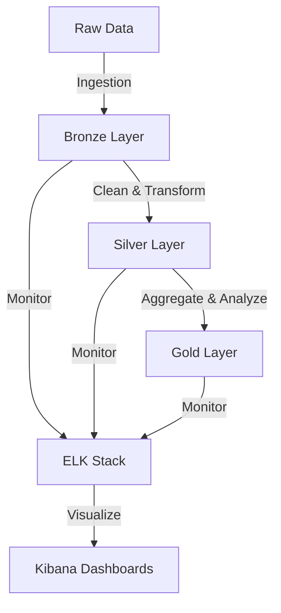

# 🚲 NYCBS (New York City Bike Share) Data Platform

<div align="center">


A modern data platform for analyzing NYC Bike Share data using Apache Spark, Delta Lake, and ELK Stack.

</div>

## 🚀 Quick Start

```bash
# Clone the repository
git clone <repository-url>
cd NYCBS_CONTAINERIZED

# Start the environment
docker-compose up -d

# Access the services
Jupyter: http://localhost:8888 (token: defaulttoken)
Kibana:  http://localhost:5601
```

## 📋 Prerequisites

- Docker Desktop with WSL 2
- 8GB RAM minimum (16GB recommended)
- 20GB free disk space

## 🏗️ Architecture Overview



## 🛠️ Tech Stack

- **Data Processing**: Apache Spark 3.4
- **Storage**: Delta Lake 2.4
- **Monitoring**: ELK Stack 7.17
- **Development**: 
  - Jupyter Notebook
  - VS Code Dev Containers
  - Streamlit

## 📊 Key Features

- **Medallion Architecture**
  - Bronze: Raw data preservation
  - Silver: Cleaned & transformed data
  - Gold: Analytics-ready datasets

- **Comprehensive Monitoring**
  - Real-time performance metrics
  - Data quality tracking
  - Custom Kibana dashboards

- **Development Environment**
  - Jupyter notebooks
  - Interactive Streamlit dashboards
  - VS Code integration

## 📁 Project Structure

```
NYCBS_CONTAINERIZED/
├── 📂 notebooks/          # Jupyter notebooks
├── 📂 src/               # Source code
│   ├── 📂 utils/        # Utilities
│   └── 📂 dashboard/    # Streamlit dashboard
├── 📂 conf/             # Configuration files
├── 📂 data/             # Data directories
│   ├── landing/         # Raw data
│   ├── bronze/          # Bronze layer
│   ├── silver/          # Silver layer
│   └── gold/            # Gold layer
└── 📄 docker-compose.yml # Container orchestration
```

## 🔧 Development Setup

### VS Code Dev Container

1. Install the "Remote - Containers" extension
2. Open the project in VS Code
3. Click "Reopen in Container" when prompted
4. Start developing with all dependencies pre-configured

### Manual Setup

```bash
# Start all services
docker-compose up -d

# View logs
docker-compose logs -f

# Stop services
docker-compose down
```

## 📚 Documentation

- [Technical Documentation](documentation.md) - Detailed architecture and implementation
- [Service Catalog](SERVICE_CATALOG.md) - Service endpoints and configurations

## 🤝 Contributing

1. Fork the repository
2. Create a feature branch
3. Commit your changes
4. Push to the branch
5. Create a Pull Request

## 📝 License

This project is licensed under the MIT License - see the [LICENSE](LICENSE) file for details.

## 🆘 Troubleshooting

See our [Troubleshooting Guide](documentation.md#troubleshooting) for common issues and solutions. 