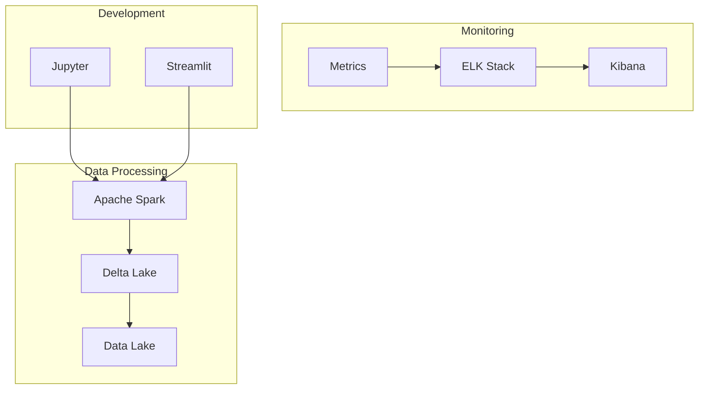
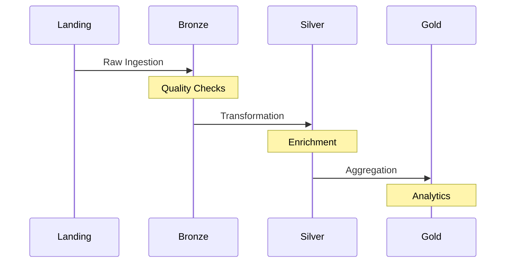
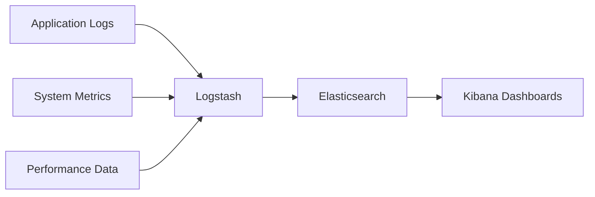

# Technical Documentation

## Table of Contents

- [Architecture Overview](#architecture-overview)
- [Data Processing Pipeline](#data-processing-pipeline)
- [Monitoring & Observability](#monitoring--observability)
- [Security & Compliance](#security--compliance)
- [Performance Optimization](#performance-optimization)
- [Troubleshooting Guide](#troubleshooting-guide)

## Architecture Overview

### System Components


### Technology Stack Details

#### Core Components
| Component | Version | Purpose |
|-----------|---------|----------|
| Apache Spark | 3.4 | Data processing engine |
| Delta Lake | 2.4 | Table format & ACID transactions |
| Python | 3.10 | Programming language |
| ELK Stack | 7.17 | Logging & monitoring |

#### Supporting Tools
- Jupyter Notebook for development
- Streamlit for dashboards
- Docker for containerization
- VS Code for IDE support

## Data Processing Pipeline

### Medallion Architecture Implementation

#### 1. Landing Zone (Raw)
- Location: `/data/landing`
- Purpose: Initial data ingestion
- Format: Raw CSV files
- Retention: 7 days

#### 2. Bronze Layer
- Location: `/data/bronze`
- Purpose: Data validation & quality checks
- Format: Delta tables
- Schema enforcement: Basic type validation

#### 3. Silver Layer
- Location: `/data/silver`
- Purpose: Data transformation & enrichment
- Format: Delta tables with optimizations
- Features:
  - Data cleaning
  - Type conversions
  - Reference data joins

#### 4. Gold Layer
- Location: `/data/gold`
- Purpose: Analytics-ready datasets
- Format: Optimized Delta tables
- Features:
  - Aggregations
  - Business metrics
  - Performance optimizations

### Data Flow


## Monitoring & Observability

### Logging Architecture


### Log Categories
1. **Application Logs**
   - Location: `/var/log/NYCBS_CONTAINERIZED/jupyter`
   - Format: JSON structured logging
   - Retention: 30 days

2. **Performance Metrics**
   - Location: `/var/log/NYCBS_CONTAINERIZED/spark`
   - Metrics: CPU, memory, I/O
   - Granularity: 1-minute intervals

3. **Data Quality Metrics**
   - Location: `/var/log/NYCBS_CONTAINERIZED/delta`
   - Metrics: Schema validation, null counts
   - Frequency: Per-batch basis

## Security & Compliance

### Authentication & Authorization
- Container user: `aldamiz` (UID 1000)
- File permissions: 770 for data directories
- Network access: localhost-only bindings

### Data Protection
- Volume encryption
- Secure configuration storage
- Audit logging enabled

### Network Security
- Internal network isolation
- Port-level access control
- TLS encryption for services

## Performance Optimization

### Spark Configurations
```yaml
spark.sql.adaptive.enabled: true
spark.sql.adaptive.coalescePartitions.enabled: true
spark.sql.shuffle.partitions: 200
```

### Resource Allocation
```yaml
spark-iceberg:
  limits:
    cpu: 4
    memory: 8G
  reservations:
    cpu: 2
    memory: 4G
```

### Delta Lake Optimizations
- Z-ordering on key columns
- Data skipping
- Partition optimization

## Troubleshooting Guide

### Common Issues

#### 1. Container Startup Failures
```bash
# Check container logs
docker logs spark-iceberg

# Verify health status
docker ps -a
```

#### 2. Permission Issues
```bash
# Fix log directory permissions
sudo chown -R 1000:1000 /var/log/NYCBS_CONTAINERIZED
sudo chmod -R 770 /var/log/NYCBS_CONTAINERIZED
```

#### 3. Resource Constraints
- Increase Docker memory limit
- Adjust Spark executor memory
- Monitor resource usage

### Health Checks
```bash
# Elasticsearch
curl -f http://localhost:9200/_cluster/health

# Jupyter
curl -f "http://localhost:8888/api/status?token=${JUPYTER_TOKEN}"

# Kibana
curl -f http://localhost:5601/api/status
``` 