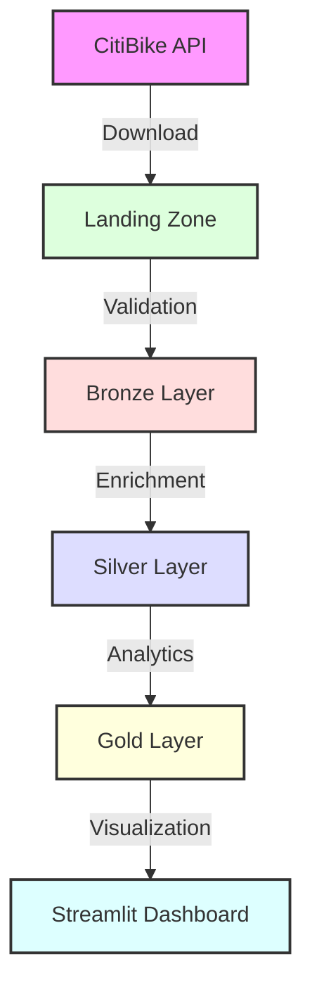

# NYC Bike Share Analytics Overview

## Project Description

NYC Bike Share Analytics is a containerized data analytics platform that processes and analyzes CitiBike trip data. The platform follows the medallion architecture pattern and provides interactive visualizations through a Streamlit dashboard.

## Features

### Data Lake Architecture
- **Landing Zone**: Raw data ingestion from CitiBike API
- **Bronze Layer**: Validated raw data in Delta format
- **Silver Layer**: Enriched data with additional features
- **Gold Layer**: Analytics-ready views and metrics

### Analytics & Visualization
- Interactive Streamlit dashboard
- Jupyter notebooks for analysis
- Real-time metrics and KPIs
- Geospatial visualizations

### Monitoring & Logging
- ELK Stack integration
- Structured logging
- Performance monitoring
- Query analytics

## Technology Stack

### Core Components
| Component | Version | Purpose |
|-----------|---------|----------|
| Apache Spark | 3.4 | Data processing engine |
| Delta Lake | 2.4 | Table format & ACID transactions |
| Python | 3.10 | Programming language |
| ELK Stack | 7.17 | Logging & monitoring |
| Streamlit | Latest | Interactive dashboards |

### Infrastructure
- Docker and Docker Compose for containerization
- Git for version control
- Jupyter Lab for development
- VS Code for IDE support

## System Architecture

### Component Diagram


### Directory Structure
```
nycbs_containerized/
├── conf/                    # Configuration files
│   ├── logstash/           # Logstash pipeline configs
│   ├── spark-defaults.conf # Spark configuration
│   └── log4j.properties   # Logging configuration
├── src/                   # Source code
│   ├── dashboard/        # Streamlit dashboard
│   ├── notebooks/       # Jupyter notebooks
│   └── utils/          # Shared utilities
├── data/               # Data directories (mounted volumes)
│   ├── landing/       # Raw data ingestion
│   ├── bronze/        # Validated data
│   ├── silver/        # Enriched data
│   └── gold/          # Analytics views
└── documentation/     # Project documentation
```

## Key Features

### 1. Data Processing
- Automated data ingestion from CitiBike API
- Schema validation and quality checks
- Feature engineering and enrichment
- Analytics view generation

### 2. Analytics Dashboard
- Revenue analysis and metrics
- Station utilization patterns
- Temporal usage analysis
- Route popularity insights

### 3. Monitoring
- Real-time performance metrics
- Data quality monitoring
- System health checks
- Error tracking and alerts

## Getting Started

1. [Installation Guide](installation.md)
2. [Project Structure](../2_development/project_structure.md)
3. [Data Pipeline](../3_data_pipeline/architecture.md)
4. [Dashboard Guide](../4_analytics/dashboard.md)

## Additional Resources

- [Data Dictionary](../3_data_pipeline/schemas.md)
- [Troubleshooting Guide](../6_troubleshooting/common_issues.md)
- [Maintenance Tasks](../5_operations/maintenance.md) 