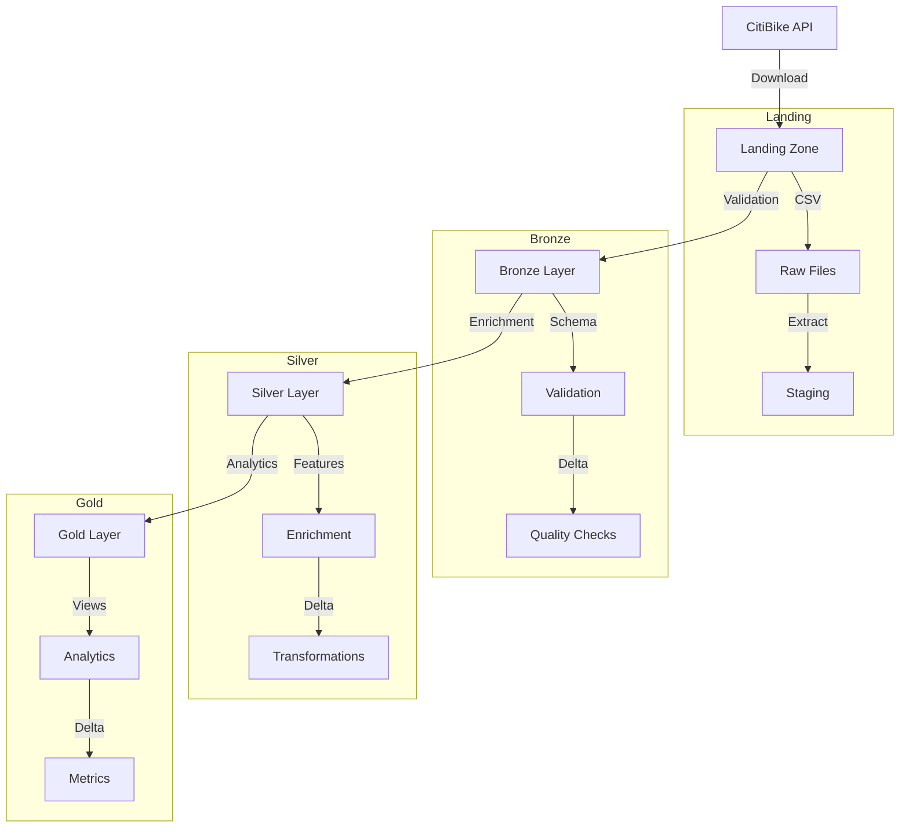

# Data Pipeline Architecture

## Overview

The NYC Bike Share Analytics data pipeline follows the medallion architecture pattern, organizing data processing into distinct layers: Landing → Bronze → Silver → Gold. Each layer serves a specific purpose in the data transformation journey.

## Pipeline Flow



## Data Layers

### 1. Landing Zone
- **Purpose**: Initial data ingestion
- **Location**: `/home/aldamiz/data/landing`
- **Format**: CSV files
- **Operations**:
  - Download from CitiBike API
  - Extract ZIP archives
  - Stage for processing
- **Retention**: Until processed

### 2. Bronze Layer
- **Purpose**: Data validation and quality
- **Location**: `/home/aldamiz/data/bronze`
- **Format**: Delta tables
- **Operations**:
  - Schema enforcement
  - Data type validation
  - Quality checks
  - Source tracking
- **Retention**: 90 days

### 3. Silver Layer
- **Purpose**: Data enrichment
- **Location**: `/home/aldamiz/data/silver`
- **Format**: Delta tables
- **Operations**:
  - Feature engineering
  - Data transformations
  - Quality improvements
  - Metric calculations
- **Retention**: 180 days

### 4. Gold Layer
- **Purpose**: Analytics views
- **Location**: `/home/aldamiz/data/gold/analytics`
- **Format**: Delta tables
- **Operations**:
  - Aggregations
  - View creation
  - KPI calculations
  - Report generation
- **Retention**: Indefinite

## Processing Steps

### 1. Data Ingestion
```python
# Download and validate files
for source in sources:
    response = requests.get(source['url'])
    with zipfile.ZipFile(zip_file_path, 'r') as zip_ref:
        zip_ref.extractall(landing_path)
```

### 2. Bronze Processing
```python
# Schema validation and type conversion
bronze_df = (spark.read.csv(file_path)
    .withColumn("started_at", F.to_timestamp("started_at"))
    .withColumn("ended_at", F.to_timestamp("ended_at")))

# Quality checks
quality_metrics = log_data_quality(bronze_df, "bronze_validation")
```

### 3. Silver Transformations
```python
# Feature engineering
silver_df = bronze_df.withColumn(
    "ride_duration_minutes",
    F.round((F.unix_timestamp("ended_at") - 
             F.unix_timestamp("started_at")) / 60, 2)
).withColumn(
    "ride_distance_km",
    calculate_distance("start_lat", "start_lng", "end_lat", "end_lng")
)
```

### 4. Gold Analytics
```python
# Create analytics views
revenue_metrics = silver_df.groupBy("year", "month").agg(
    F.count("*").alias("total_trips"),
    F.sum("is_charged_trip").alias("charged_trips"),
    F.sum("extra_time_charge").alias("revenue_potential")
)
```

## Quality Control

### 1. Data Validation
- Schema enforcement
- Non-null constraints
- Data type checking
- Range validation

### 2. Quality Metrics
```python
def log_data_quality(df, stage):
    metrics = {
        "row_count": df.count(),
        "null_counts": get_null_counts(df),
        "duplicate_count": get_duplicate_count(df)
    }
    logger.info(f"Quality metrics for {stage}", extra=metrics)
```

### 3. Monitoring
- Processing status
- Record counts
- Error rates
- Performance metrics

## Performance Optimization

### 1. Delta Lake Features
```python
# Optimize tables regularly
spark.sql(f"""
    OPTIMIZE {table_name}
    ZORDER BY (year, month)
""")
```

### 2. Partitioning Strategy
- Partition by year and month
- Z-order by frequent columns
- Regular compaction
- Statistics collection

### 3. Processing Efficiency
- Parallel processing
- Caching strategy
- Resource allocation
- Query optimization

## Error Handling

### 1. Retry Logic
```python
@retry(max_attempts=3, delay=5)
def download_file(url, path):
    response = requests.get(url)
    response.raise_for_status()
    return response
```

### 2. Data Recovery
```python
# Restore table to timestamp
spark.sql(f"""
    RESTORE TABLE {table_name}
    TO TIMESTAMP AS OF {timestamp}
""")
```

### 3. Monitoring
- Error tracking
- Alert generation
- Status logging
- Health checks

## Related Documentation

- [Data Dictionary](schemas.md)
- [Ingestion Process](ingestion.md)
- [Processing Details](processing.md)
- [Monitoring Setup](../5_operations/monitoring.md) 