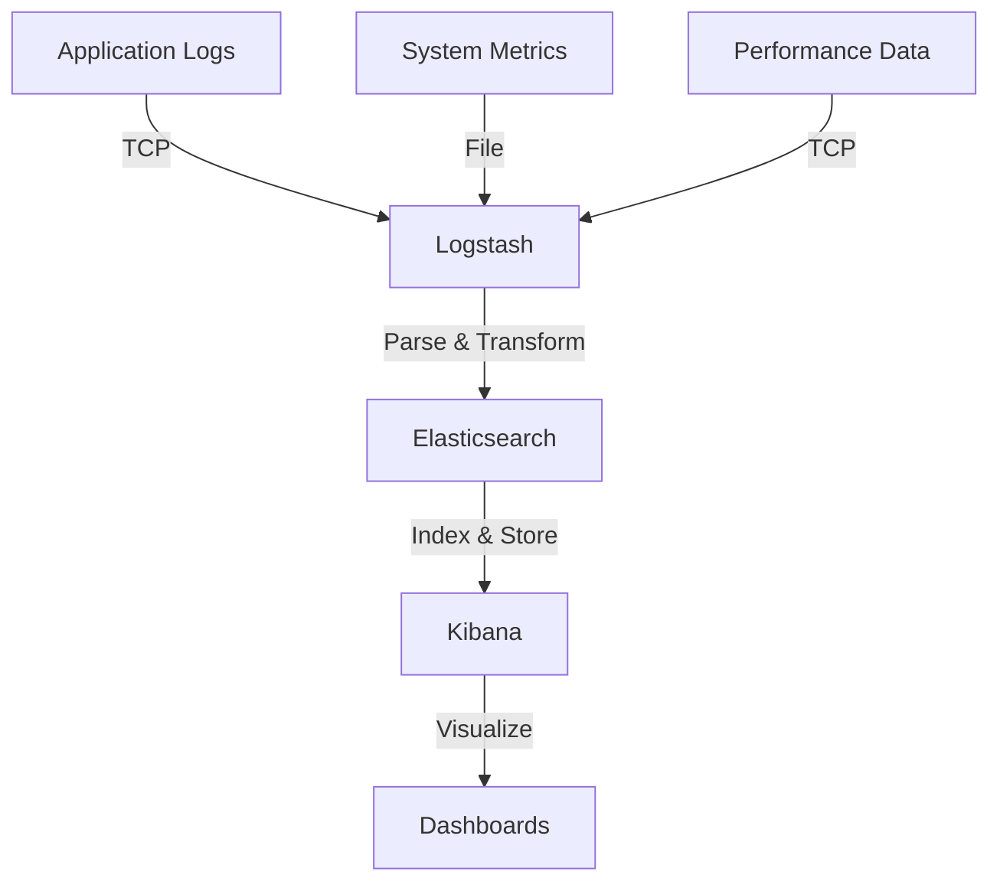

# Monitoring & Observability

## Overview

NYC Bike Share Analytics uses the ELK Stack (Elasticsearch, Logstash, Kibana) for comprehensive monitoring and observability. This document describes the monitoring architecture and configuration.

## Architecture



## Components

### 1. Log Sources

#### Application Logs
- **Source**: `src/notebooks/nycbs.ipynb`
- **Location**: `/var/log/nycbs/jupyter/`
- **Format**: JSON structured logging
- **Levels**:
  - INFO: Normal operations
  - ERROR: Failures
  - WARN: Issues
  - DEBUG: Details

#### Performance Metrics
- **Source**: Spark applications
- **Location**: `/var/log/nycbs/spark/`
- **Metrics**:
  - Query execution time
  - Memory usage
  - Data processing rates
  - Resource utilization

#### System Metrics
- **Source**: Container stats
- **Location**: `/var/log/nycbs/system/`
- **Metrics**:
  - CPU usage
  - Memory consumption
  - Disk I/O
  - Network traffic

### 2. Log Structure

#### Common Fields
```json
{
  "timestamp": "2025-03-06T12:00:00.000Z",
  "level": "INFO",
  "logger": "nycbs",
  "message": "Operation completed",
  "context": {
    "operation": "data_processing",
    "component": "bronze_layer",
    "duration_ms": 1234
  }
}
```

#### Performance Metrics
```json
{
  "event_type": "query_performance",
  "query_name": "bronze_write",
  "action": "write",
  "duration_ms": 1500,
  "record_count": 10000,
  "timestamp": "2025-03-06T12:00:00.000Z"
}
```

### 3. Logstash Configuration

```conf
input {
  tcp {
    port => 5000
    codec => json
  }
  file {
    path => "/var/log/nycbs/**/*.log"
    type => "file"
  }
}

filter {
  json {
    source => "message"
  }
  date {
    match => ["timestamp", "ISO8601"]
  }
}

output {
  elasticsearch {
    hosts => ["elasticsearch:9200"]
    index => "nycbs-logs-%{+YYYY.MM.dd}"
  }
}
```

## Kibana Dashboards

### 1. Application Health
- Error rates and trends
- Response times
- Success rates
- Resource usage

### 2. Data Pipeline
- Processing rates
- Quality metrics
- Latency stats
- Volume metrics

### 3. System Performance
- CPU utilization
- Memory usage
- Disk space
- Network I/O

## Alerts

### 1. Critical Alerts
- Service failures
- Data quality issues
- Resource exhaustion
- Security events

### 2. Warning Alerts
- Performance degradation
- Unusual patterns
- Resource warnings
- Quality thresholds

## Monitoring Tasks

### 1. Daily Checks
```bash
# Check service health
docker-compose ps

# View recent errors
docker-compose logs --tail=100 logstash | grep ERROR

# Check disk space
docker system df
```

### 2. Weekly Tasks
- Review error patterns
- Check resource trends
- Analyze performance
- Update dashboards

### 3. Monthly Tasks
- Clean old indices
- Optimize storage
- Update alerts
- Review metrics

## Performance Monitoring

### 1. Query Performance
```python
def monitor_query_performance(query_name, df, action):
    start_time = time.time()
    result = df.count()  # or other action
    duration_ms = (time.time() - start_time) * 1000
    
    logger.info("Query performance",
               extra={
                   "query_name": query_name,
                   "action": action,
                   "duration_ms": duration_ms,
                   "record_count": result
               })
```

### 2. Resource Usage
```python
def log_resource_metrics():
    metrics = {
        "cpu_percent": psutil.cpu_percent(),
        "memory_percent": psutil.virtual_memory().percent,
        "disk_usage": psutil.disk_usage('/').percent
    }
    logger.info("Resource metrics", extra=metrics)
```

## Health Checks

### 1. Service Health
```bash
# Elasticsearch
curl -f http://localhost:9200/_cluster/health

# Logstash
nc -zv localhost 5000

# Kibana
curl -f http://localhost:5601/api/status
```

### 2. Log Health
```bash
# Check log files
ls -la /var/log/nycbs/**/*.log

# Check file rotation
logrotate -d /etc/logrotate.d/nycbs
```

## Troubleshooting

### 1. Common Issues
- Log parsing errors
- Index failures
- Storage issues
- Connection problems

### 2. Recovery Steps
```bash
# Restart logging pipeline
docker-compose restart logstash

# Clear old indices
curl -X DELETE "localhost:9200/nycbs-logs-*"

# Rebuild indices
curl -X POST "localhost:9200/_reindex"
```

## Related Documentation

- [Logging Setup](logging.md)
- [Maintenance Tasks](maintenance.md)
- [Troubleshooting](../6_troubleshooting/common_issues.md) 