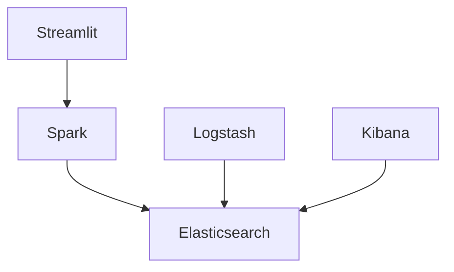

# Service Catalog

<div align="center">


</div>

## Quick Reference

| Service | URL | Port | Health Check |
|---------|-----|------|--------------|
| Jupyter | http://localhost:8888 | 8888 | `/api/status` |
| Kibana | http://localhost:5601 | 5601 | `/api/status` |
| Elasticsearch | http://localhost:9200 | 9200 | `/_cluster/health` |
| Spark UI | http://localhost:4041 | 4041 | N/A |
| Streamlit | http://localhost:8501 | 8501 | `/_stcore/health` |

## Service Details

### 🔬 Development Services

#### Jupyter Notebook
- **URL:** http://localhost:8888
- **Authentication:** Token-based
- **Default Token:** `defaulttoken`
- **Environment:**
  - Python 3.10
  - PySpark 3.4
  - Delta Lake 2.4
- **Volume Mounts:**
  ```yaml
  - ./notebooks:/home/aldamiz/notebooks:rw
  - ./src:/home/aldamiz/src:ro
  ```
- **Health Check:**
  ```bash
  curl -f "http://localhost:8888/api/status?token=${JUPYTER_TOKEN}"
  ```

#### Streamlit Dashboard
- **URL:** http://localhost:8501
- **Features:**
  - Real-time data visualization
  - Interactive filters
  - Auto-refresh capabilities
- **Volume Mounts:**
  ```yaml
  - ./src/dashboard:/home/aldamiz/src/dashboard:ro
  ```
- **Health Check:**
  ```bash
  curl -f "http://localhost:8501/_stcore/health"
  ```

### 📊 Monitoring Stack

#### Elasticsearch
- **URL:** http://localhost:9200
- **Key Endpoints:**
  ```yaml
  Health: /_cluster/health
  Indices: /_cat/indices
  Stats: /_stats
  ```
- **Configuration:**
  ```yaml
  memory.limit: 4G
  discovery.type: single-node
  xpack.security.enabled: false
  ```
- **Volume Mounts:**
  ```yaml
  - elasticsearch_data:/usr/share/elasticsearch/data:rw
  ```

#### Logstash
- **Ports:**
  - 5044: Beats input
  - 9600: API endpoint
- **Pipeline Configuration:**
  ```yaml
  input:
    - type: file
      path: /var/log/NYCBS_CONTAINERIZED/**/*.log
  filter:
    - json:
        skip_on_invalid_json: true
  output:
    - elasticsearch:
        hosts: ["elasticsearch:9200"]
  ```
- **Volume Mounts:**
  ```yaml
  - ./conf/logstash/pipeline:/usr/share/logstash/pipeline:ro
  - streamlit_logs:/var/log/NYCBS_CONTAINERIZED/streamlit:ro
  - spark_logs:/var/log/NYCBS_CONTAINERIZED/spark:ro
  - jupyter_logs:/var/log/NYCBS_CONTAINERIZED/jupyter:ro
  ```

#### Kibana
- **URL:** http://localhost:5601
- **Features:**
  - Log exploration
  - Metric visualization
  - Custom dashboards
- **Default Dashboards:**
  1. System Overview
     - Container metrics
     - Resource usage
     - Health status
  2. Data Pipeline
     - Processing metrics
     - Data quality
     - Error rates
  3. User Activity
     - Session metrics
     - Query performance
     - Usage patterns

### 🔄 Data Processing

#### Spark Master
- **UI URL:** http://localhost:4041
- **Features:**
  - Job monitoring
  - Stage visualization
  - SQL execution plans
- **Resource Limits:**
  ```yaml
  cpu: 4
  memory: 8G
  ```
- **Volume Mounts:**
  ```yaml
  - data_landing:/home/aldamiz/data/landing:rw
  - data_bronze:/home/aldamiz/data/bronze:rw
  - data_silver:/home/aldamiz/data/silver:rw
  - data_gold:/home/aldamiz/data/gold:rw
  ```

## Log Directory Structure

```
/var/log/NYCBS_CONTAINERIZED/
├── jupyter/
│   ├── jupyter.log
│   └── error/
├── streamlit/
│   ├── streamlit.log
│   └── error/
├── spark/
│   ├── spark.log
│   └── executors/
└── delta/
    ├── operations.log
    └── history/
```

## Volume Management

### Data Volumes
```yaml
data_landing:
  name: NYCBS_CONTAINERIZED_data_landing
data_bronze:
  name: NYCBS_CONTAINERIZED_data_bronze
data_silver:
  name: NYCBS_CONTAINERIZED_data_silver
data_gold:
  name: NYCBS_CONTAINERIZED_data_gold
```

### Log Volumes
```yaml
jupyter_logs:
  name: NYCBS_CONTAINERIZED_jupyter_logs
streamlit_logs:
  name: NYCBS_CONTAINERIZED_streamlit_logs
spark_logs:
  name: NYCBS_CONTAINERIZED_spark_logs
delta_logs:
  name: NYCBS_CONTAINERIZED_delta_logs
```

## Health Monitoring

### Service Dependencies


### Health Check Commands
```bash
# Check all services
for service in elasticsearch logstash kibana spark-iceberg; do
    docker ps -f name=$service --format "{{.Status}}"
done
``` 